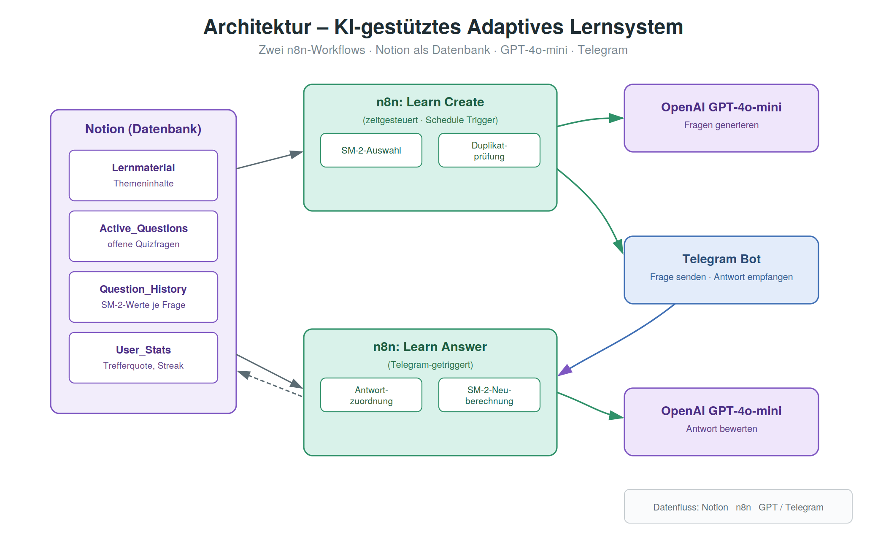
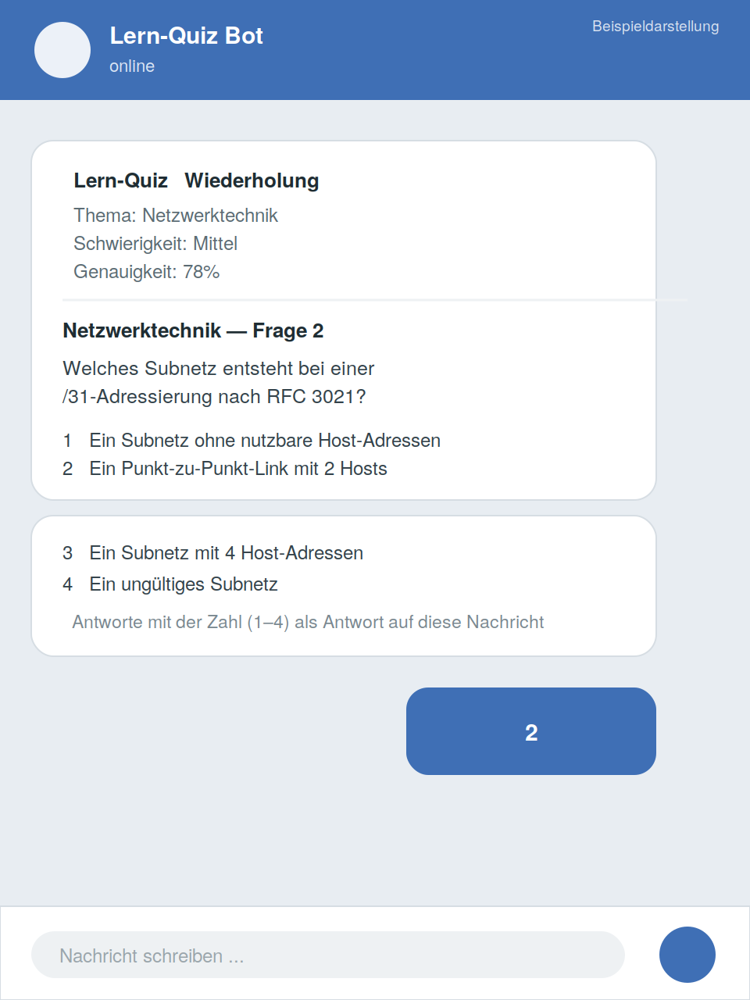
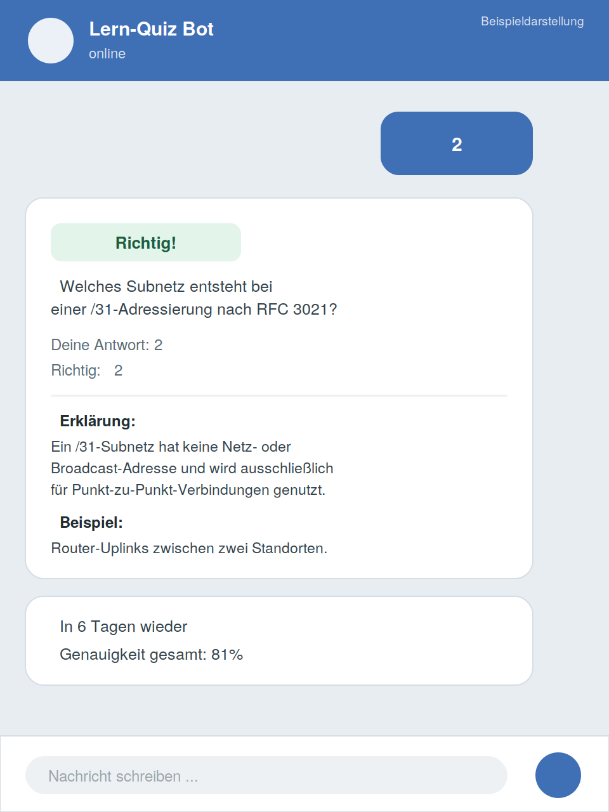

# 🧠 KI-gestütztes Adaptives Lernsystem

Ein Telegram-Bot zur automatisierten Wissensabfrage mit KI-generierten Quizfragen,
gekoppelt an Notion als Datenbank und einem Spaced-Repetition-Algorithmus (SM-2)
zur individuell angepassten Wiederholungsplanung.

> Privates Lernprojekt | n8n (self-hosted), Notion, OpenAI GPT-4o-mini, Telegram

## 📌 Motivation

Beim Lernen für Prüfungen (IHK, Abitur, Studium) reicht reines Lesen von
Unterlagen oft nicht aus – aktives Abfragen zum richtigen Zeitpunkt verbessert
die Merkfähigkeit deutlich (Spaced Repetition). Ziel war ein System, das:

- eigenes Lernmaterial automatisch in Quizfragen umwandelt
- Fragen zum optimalen Zeitpunkt erneut stellt (nicht zu früh, nicht zu spät)
- sich an die individuelle Fehlerquote anpasst (schwierigere Themen häufiger)
- ganz ohne zusätzliche App nutzbar ist – direkt über Telegram

## 🏗️ Architektur



Zwei n8n-Workflows, verbunden über eine gemeinsame Notion-Datenbankstruktur:

**1. Learn Create** *(zeitgesteuert)*

```
Schedule Trigger → Lernmaterial + Verlauf aus Notion laden
→ SM-2-Auswahl (fällige Wiederholungen + adaptive Auffüllung)
→ GPT-4o-mini generiert Quizfragen (Duplikatsprüfung inklusive)
→ Versand per Telegram → Speicherung in Notion
```

Duplikate werden dabei zuverlässig ausgeschlossen – auch bei leicht
unterschiedlicher Formulierung:

```javascript
let dup = existingTexts.has(questionLower) || seen.has(questionLower);
if (!dup) {
  const prefix = questionLower.substring(0, 50);
  for (const existing of existingTexts) {
    if (existing.substring(0, 50) === prefix) { dup = true; break; }
  }
}
if (dup) continue; // Frage überspringen, nicht erneut stellen
```

**2. Learn Answer** *(Telegram-getriggert)*

```
Telegram Reply → Zuordnung zur offenen Frage
→ GPT-4o-mini bewertet die Antwort inhaltlich
→ SM-2-Neuberechnung (Ease-Factor, Intervall, nächstes Fälligkeitsdatum)
→ Statistik-Update (Trefferquote, Streak)
→ Feedback mit Erklärung per Telegram
```

**Notion-Datenbanken:** `Lernmaterial` · `Active_Questions` · `Question_History` · `User_Stats`

## 🤖 Warum SM-2 (SuperMemo-2)?

Statt Fragen zufällig oder immer gleich oft zu wiederholen, berechnet SM-2 nach
jeder Antwort ein individuelles Wiederholungsintervall:

- Richtig beantwortet → Intervall wächst (Ease-Factor-abhängig)
- Falsch beantwortet → Intervall wird zurückgesetzt, Frage kommt bald wieder
- Ease-Factor passt sich graduell an die tatsächliche Schwierigkeit für den
  Nutzer an (nicht an eine pauschale Kategorie)

So werden Themen, die gut sitzen, seltener abgefragt – Wackelkandidaten häufiger.

## 💻 SM-2-Berechnung (Auszug)

```javascript
if (isCorrect) {
  tc++; reps++;
  if (reps === 1) interval = 1;
  else if (reps === 2) interval = 6;
  else interval = Math.round(interval * ef);
} else {
  ti++; reps = 0; interval = 0;
}

ef = ef + (0.1 - (5 - quality) * (0.08 + (5 - quality) * 0.02));
if (ef < 1.3) ef = 1.3;
ef = Math.round(ef * 100) / 100;
```

*Vollständige Logik in [`workflows/Learn_Answer.json`](workflows/Learn_Answer.json)*

## 🧩 Adaptive Fragenauswahl

Die "SR Selector + Adaptive"-Logik in **Learn Create** entscheidet bei jedem Lauf:

- Welche Themen sind laut SM-2 fällig?
- Wie viele neue Themen sollen ergänzt werden, falls noch Kapazität frei ist?
- Welche Schwierigkeitsstufe passt aktuell zur bisherigen Trefferquote?

```javascript
// Schwierigkeit steigt automatisch nach mehreren richtigen Antworten in Folge
if (consecutiveCorrect >= 3 && idx < 3) {
  difficulty = DIFFICULTY_LEVELS[idx + 1];
  changed = true;
  reason = '3x richtig in Folge → Schwierigkeit erhöht';
} else if (totalAnswers >= 5 && accuracy > 0.8 && idx < 3) {
  difficulty = DIFFICULTY_LEVELS[idx + 1];
  changed = true;
}
```

## ✅ Antwortbewertung per KI (statt stumpfem String-Vergleich)

Die Bewertung nutzt GPT-4o-mini als "IT-Ausbilder"-Persona, die die Antwort
inhaltlich einordnet (`quality`-Skala 0–5, analog zum klassischen SM-2-Modell),
statt nur exakte Übereinstimmung zu prüfen – inklusive kurzer Erklärung und
Praxisbeispiel als Feedback.

## 💬 Prompt-Beispiel (Fragengenerierung)

```
Generiere ein JSON-Array mit EXAKT {total_questions_expected} Quizfragen.
Für JEDES Thema GENAU {questions_per_page} Fragen.

Format — NUR dieses JSON-Array:
[{"page_id":"...","subject":"...","question":"...",
  "options":["A","B","C","D"],"correct_answer":"A",
  "explanation":"2-3 Sätze Erklärung."}]

Schwierigkeit: Leicht=Definitionen, Mittel=Anwendung,
Schwer=Szenarien, Experte=Grenzfälle

WICHTIG: Keine Duplikate · Nur Infos aus dem Lernmaterial · Nur JSON-Array
```

## 🖼️ Screenshots

| | |
|---|---|
|  Quiz-Frage per Telegram |  Auswertung mit Erklärung |

## 🛠️ Tech Stack

`n8n (self-hosted)` `Notion API` `OpenAI GPT-4o-mini` `Telegram Bot API`
`JavaScript (Code Nodes)` `SM-2 Spaced-Repetition-Algorithmus`

## 📁 Repo-Struktur

- [`diagrams/`](diagrams/) → Architektur-Übersicht
- [`screenshots/`](screenshots/) → Bot in Aktion (Quiz & Feedback)
- [`workflows/Learn_Create.json`](workflows/Learn_Create.json) → n8n-Workflow: Fragengenerierung & Versand
- [`workflows/Learn_Answer.json`](workflows/Learn_Answer.json) → n8n-Workflow: Auswertung & SM-2-Berechnung

---

*Aus Datenschutzgründen wurden Telegram-Chat-ID, Notion-Datenbank-IDs,
Zugangsdaten-Referenzen und die n8n-Instanz-ID aus den Workflow-Dateien
entfernt bzw. anonymisiert.*
